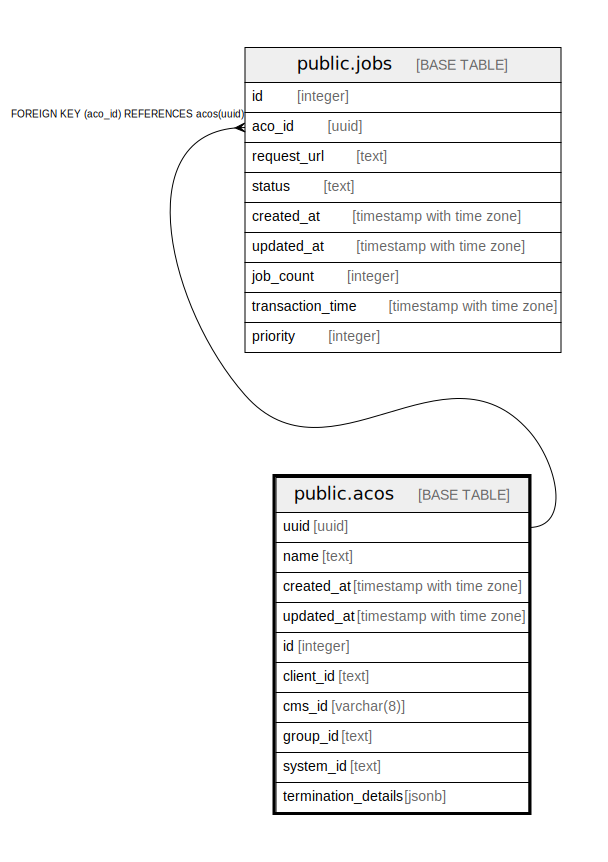

# public.acos

## Description

## Columns

| Name | Type | Default | Nullable | Children | Parents | Comment |
| ---- | ---- | ------- | -------- | -------- | ------- | ------- |
| uuid | uuid |  | false | [public.jobs](public.jobs.md) |  |  |
| name | text |  | false |  |  |  |
| created_at | timestamp with time zone | now() | false |  |  |  |
| updated_at | timestamp with time zone | now() | false |  |  |  |
| id | integer | nextval('acos_id_seq'::regclass) | false |  |  |  |
| client_id | text |  | true |  |  |  |
| cms_id | varchar(8) |  | true |  |  |  |
| group_id | text |  | true |  |  |  |
| system_id | text |  | true |  |  |  |
| termination_details | jsonb |  | true |  |  |  |

## Constraints

| Name | Type | Definition |
| ---- | ---- | ---------- |
| acos_pkey | PRIMARY KEY | PRIMARY KEY (uuid) |
| acos_cms_id_key | UNIQUE | UNIQUE (cms_id) |

## Indexes

| Name | Definition |
| ---- | ---------- |
| acos_pkey | CREATE UNIQUE INDEX acos_pkey ON public.acos USING btree (uuid) |
| acos_cms_id_key | CREATE UNIQUE INDEX acos_cms_id_key ON public.acos USING btree (cms_id) |

## Triggers

| Name | Definition |
| ---- | ---------- |
| set_timestamp | CREATE TRIGGER set_timestamp BEFORE UPDATE ON public.acos FOR EACH ROW EXECUTE FUNCTION trigger_set_timestamp() |

## Relations

---

> Generated by [tbls](https://github.com/k1LoW/tbls)
