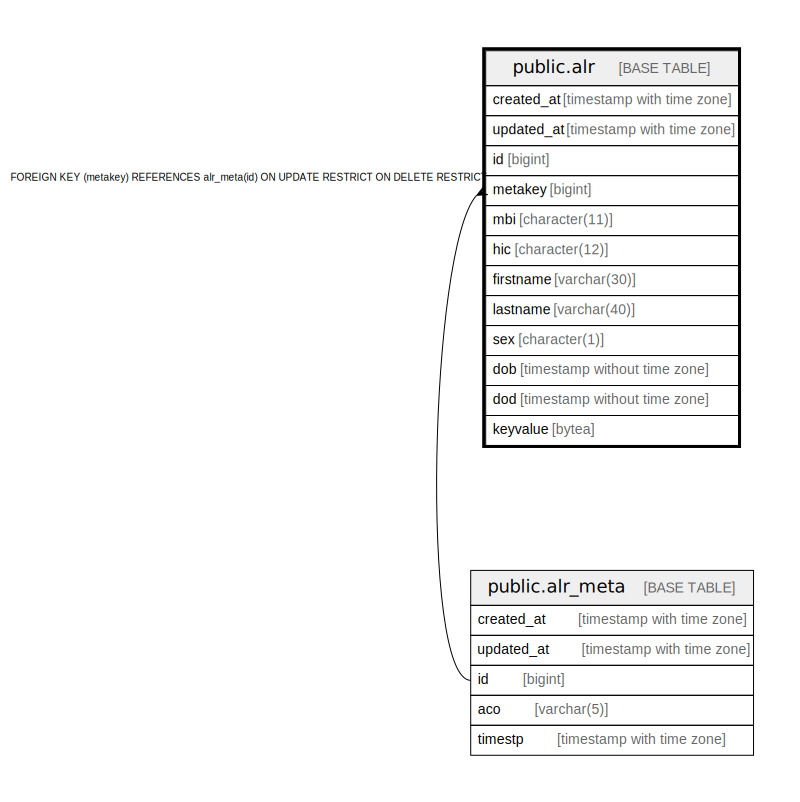

# public.alr

## Description

## Columns

| Name | Type | Default | Nullable | Children | Parents | Comment |
| ---- | ---- | ------- | -------- | -------- | ------- | ------- |
| created_at | timestamp with time zone | now() | false |  |  |  |
| updated_at | timestamp with time zone | now() | false |  |  |  |
| id | bigint | nextval('alr_id_seq'::regclass) | false |  |  |  |
| metakey | bigint |  | false |  | [public.alr_meta](public.alr_meta.md) |  |
| mbi | character(11) |  | false |  |  |  |
| hic | character(12) |  | true |  |  |  |
| firstname | varchar(30) |  | true |  |  |  |
| lastname | varchar(40) |  | true |  |  |  |
| sex | character(1) |  | true |  |  |  |
| dob | timestamp without time zone |  | true |  |  |  |
| dod | timestamp without time zone |  | true |  |  |  |
| keyvalue | bytea |  | true |  |  |  |

## Constraints

| Name | Type | Definition |
| ---- | ---- | ---------- |
| foreign_key_alr | FOREIGN KEY | FOREIGN KEY (metakey) REFERENCES alr_meta(id) ON UPDATE RESTRICT ON DELETE RESTRICT |

## Triggers

| Name | Definition |
| ---- | ---------- |
| set_timestamp | CREATE TRIGGER set_timestamp BEFORE UPDATE ON public.alr FOR EACH ROW EXECUTE FUNCTION trigger_set_timestamp() |

## Relations

---

> Generated by [tbls](https://github.com/k1LoW/tbls)
