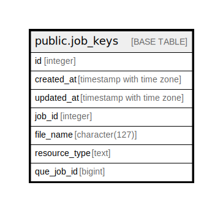

# public.job_keys

## Description

## Columns

| Name | Type | Default | Nullable | Children | Parents | Comment |
| ---- | ---- | ------- | -------- | -------- | ------- | ------- |
| id | integer | nextval('job_keys_id_seq'::regclass) | false |  |  |  |
| created_at | timestamp with time zone | now() | true |  |  |  |
| updated_at | timestamp with time zone | now() | true |  |  |  |
| job_id | integer | nextval('job_keys_job_id_seq'::regclass) | false |  |  |  |
| file_name | character(127) |  | true |  |  |  |
| resource_type | text |  | true |  |  |  |
| que_job_id | bigint |  | true |  |  |  |

## Constraints

| Name | Type | Definition |
| ---- | ---- | ---------- |
| job_keys_pkey | PRIMARY KEY | PRIMARY KEY (id, job_id) |

## Indexes

| Name | Definition |
| ---- | ---------- |
| job_keys_pkey | CREATE UNIQUE INDEX job_keys_pkey ON public.job_keys USING btree (id, job_id) |
| idx_job_keys_job_id_que_job_id | CREATE INDEX idx_job_keys_job_id_que_job_id ON public.job_keys USING btree (job_id, que_job_id) |

## Triggers

| Name | Definition |
| ---- | ---------- |
| set_timestamp | CREATE TRIGGER set_timestamp BEFORE UPDATE ON public.job_keys FOR EACH ROW EXECUTE FUNCTION trigger_set_timestamp() |

## Relations

---

> Generated by [tbls](https://github.com/k1LoW/tbls)
