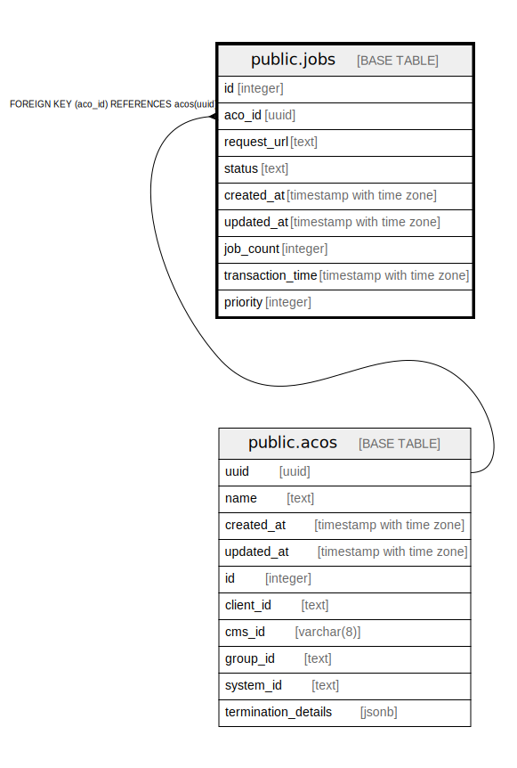

# public.jobs

## Description

## Columns

| Name | Type | Default | Nullable | Children | Parents | Comment |
| ---- | ---- | ------- | -------- | -------- | ------- | ------- |
| id | integer | nextval('jobs_id_seq'::regclass) | false |  |  |  |
| aco_id | uuid |  | false |  | [public.acos](public.acos.md) |  |
| request_url | text |  | false |  |  |  |
| status | text |  | false |  |  |  |
| created_at | timestamp with time zone | now() | false |  |  |  |
| updated_at | timestamp with time zone |  | true |  |  |  |
| job_count | integer |  | true |  |  |  |
| transaction_time | timestamp with time zone |  | true |  |  |  |
| priority | integer |  | true |  |  |  |

## Constraints

| Name | Type | Definition |
| ---- | ---- | ---------- |
| jobs_aco_id_fkey | FOREIGN KEY | FOREIGN KEY (aco_id) REFERENCES acos(uuid) |
| jobs_pkey | PRIMARY KEY | PRIMARY KEY (id) |

## Indexes

| Name | Definition |
| ---- | ---------- |
| jobs_pkey | CREATE UNIQUE INDEX jobs_pkey ON public.jobs USING btree (id) |

## Relations

---

> Generated by [tbls](https://github.com/k1LoW/tbls)
