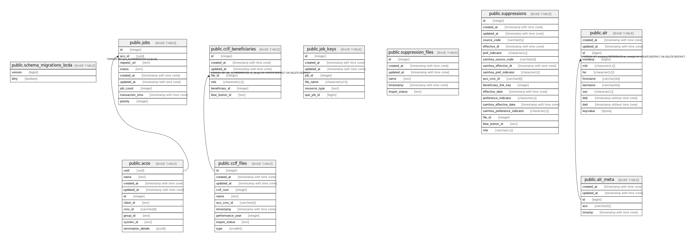

# bcda

## Tables

| Name | Columns | Comment | Type |
| ---- | ------- | ------- | ---- |
| [public.schema_migrations_bcda](public.schema_migrations_bcda.md) | 2 |  | BASE TABLE |
| [public.acos](public.acos.md) | 10 |  | BASE TABLE |
| [public.cclf_beneficiaries](public.cclf_beneficiaries.md) | 7 |  | BASE TABLE |
| [public.cclf_files](public.cclf_files.md) | 10 |  | BASE TABLE |
| [public.job_keys](public.job_keys.md) | 7 |  | BASE TABLE |
| [public.jobs](public.jobs.md) | 9 |  | BASE TABLE |
| [public.suppression_files](public.suppression_files.md) | 6 |  | BASE TABLE |
| [public.suppressions](public.suppressions.md) | 18 |  | BASE TABLE |
| [public.alr](public.alr.md) | 12 |  | BASE TABLE |
| [public.alr_meta](public.alr_meta.md) | 5 |  | BASE TABLE |

## Stored procedures and functions

| Name | ReturnType | Arguments | Type |
| ---- | ------- | ------- | ---- |
| public.trigger_set_timestamp | trigger |  | FUNCTION |

## Relations

---

> Generated by [tbls](https://github.com/k1LoW/tbls)
