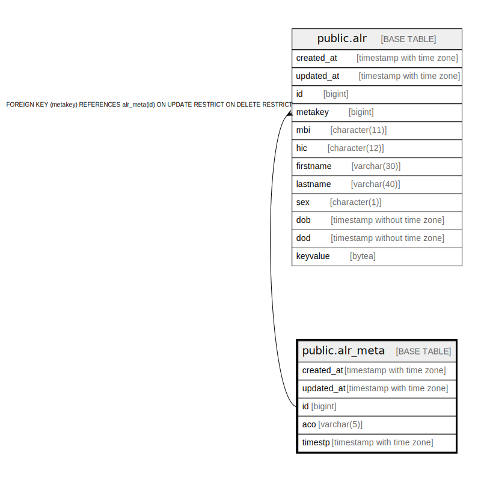

# public.alr_meta

## Description

## Columns

| Name | Type | Default | Nullable | Children | Parents | Comment |
| ---- | ---- | ------- | -------- | -------- | ------- | ------- |
| created_at | timestamp with time zone | now() | false |  |  |  |
| updated_at | timestamp with time zone | now() | false |  |  |  |
| id | bigint | nextval('alr_meta_id_seq'::regclass) | false | [public.alr](public.alr.md) |  |  |
| aco | varchar(5) |  | true |  |  |  |
| timestp | timestamp with time zone |  | true |  |  |  |

## Constraints

| Name | Type | Definition |
| ---- | ---- | ---------- |
| alr_meta_id_aco_timestp_key | UNIQUE | UNIQUE (id, aco, timestp) |
| primary_key_alr_meta | PRIMARY KEY | PRIMARY KEY (id) |

## Indexes

| Name | Definition |
| ---- | ---------- |
| alr_meta_id_aco_timestp_key | CREATE UNIQUE INDEX alr_meta_id_aco_timestp_key ON public.alr_meta USING btree (id, aco, timestp) |
| idx_metaid_timestamp | CREATE INDEX idx_metaid_timestamp ON public.alr_meta USING btree (aco, timestp) |
| primary_key_alr_meta | CREATE UNIQUE INDEX primary_key_alr_meta ON public.alr_meta USING btree (id) |

## Triggers

| Name | Definition |
| ---- | ---------- |
| set_timestamp | CREATE TRIGGER set_timestamp BEFORE UPDATE ON public.alr_meta FOR EACH ROW EXECUTE FUNCTION trigger_set_timestamp() |

## Relations

---

> Generated by [tbls](https://github.com/k1LoW/tbls)
