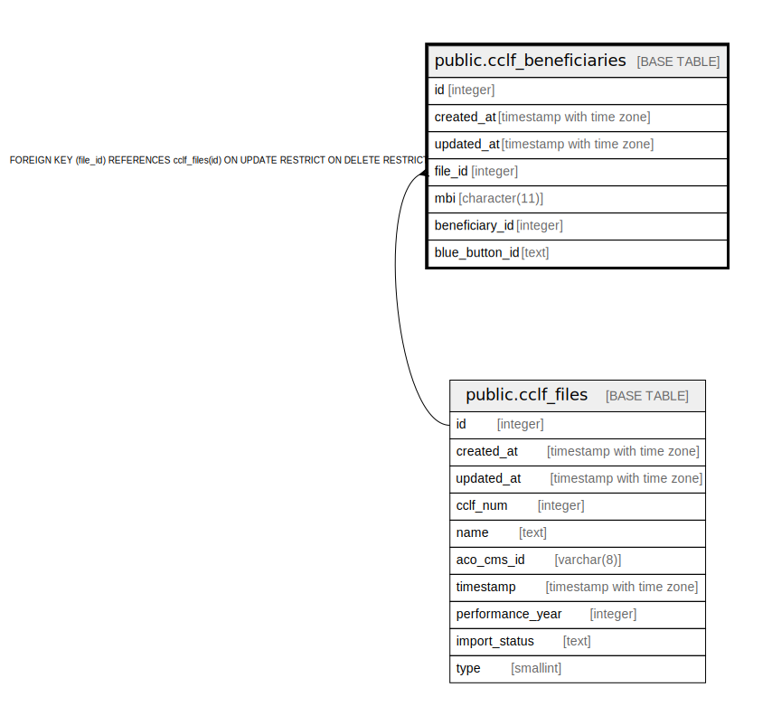

# public.cclf_beneficiaries

## Description

## Columns

| Name | Type | Default | Nullable | Children | Parents | Comment |
| ---- | ---- | ------- | -------- | -------- | ------- | ------- |
| id | integer | nextval('cclf_beneficiaries_id_seq'::regclass) | false |  |  |  |
| created_at | timestamp with time zone | now() | true |  |  |  |
| updated_at | timestamp with time zone | now() | true |  |  |  |
| file_id | integer |  | false |  | [public.cclf_files](public.cclf_files.md) |  |
| mbi | character(11) |  | false |  |  |  |
| beneficiary_id | integer |  | true |  |  |  |
| blue_button_id | text |  | true |  |  |  |

## Constraints

| Name | Type | Definition |
| ---- | ---- | ---------- |
| cclf_beneficiaries_pkey | PRIMARY KEY | PRIMARY KEY (id) |
| cclf_beneficiaries_file_id_cclf_files_id_foreign | FOREIGN KEY | FOREIGN KEY (file_id) REFERENCES cclf_files(id) ON UPDATE RESTRICT ON DELETE RESTRICT |

## Indexes

| Name | Definition |
| ---- | ---------- |
| cclf_beneficiaries_pkey | CREATE UNIQUE INDEX cclf_beneficiaries_pkey ON public.cclf_beneficiaries USING btree (id) |
| idx_cclf_beneficiaries_file_id | CREATE INDEX idx_cclf_beneficiaries_file_id ON public.cclf_beneficiaries USING btree (file_id) |

## Triggers

| Name | Definition |
| ---- | ---------- |
| set_timestamp | CREATE TRIGGER set_timestamp BEFORE UPDATE ON public.cclf_beneficiaries FOR EACH ROW EXECUTE FUNCTION trigger_set_timestamp() |

## Relations

---

> Generated by [tbls](https://github.com/k1LoW/tbls)
