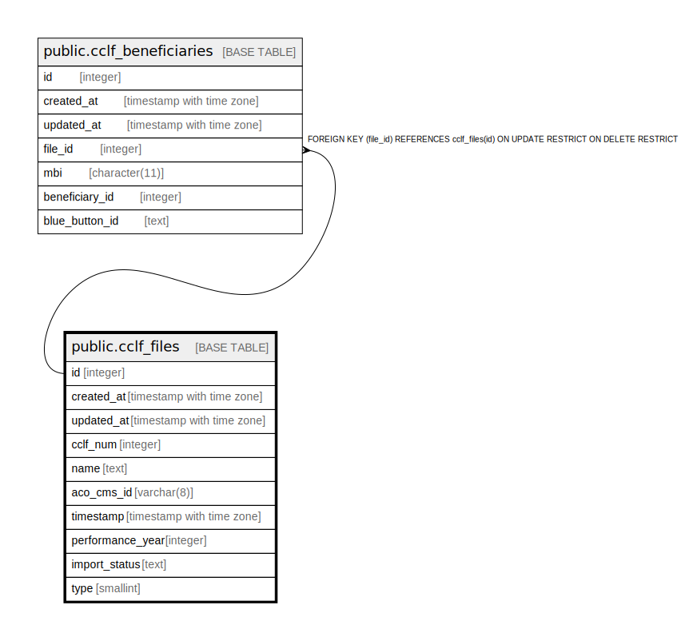

# public.cclf_files

## Description

## Columns

| Name | Type | Default | Nullable | Children | Parents | Comment |
| ---- | ---- | ------- | -------- | -------- | ------- | ------- |
| id | integer | nextval('cclf_files_id_seq'::regclass) | false | [public.cclf_beneficiaries](public.cclf_beneficiaries.md) |  |  |
| created_at | timestamp with time zone | now() | true |  |  |  |
| updated_at | timestamp with time zone | now() | true |  |  |  |
| cclf_num | integer |  | false |  |  |  |
| name | text |  | false |  |  |  |
| aco_cms_id | varchar(8) |  | true |  |  |  |
| timestamp | timestamp with time zone |  | false |  |  |  |
| performance_year | integer |  | false |  |  |  |
| import_status | text |  | true |  |  |  |
| type | smallint | 0 | true |  |  |  |

## Constraints

| Name | Type | Definition |
| ---- | ---- | ---------- |
| cclf_files_pkey | PRIMARY KEY | PRIMARY KEY (id) |

## Indexes

| Name | Definition |
| ---- | ---------- |
| cclf_files_pkey | CREATE UNIQUE INDEX cclf_files_pkey ON public.cclf_files USING btree (id) |
| idx_cclf_files_name_aco_cms_id_key | CREATE UNIQUE INDEX idx_cclf_files_name_aco_cms_id_key ON public.cclf_files USING btree (name, aco_cms_id) |

## Triggers

| Name | Definition |
| ---- | ---------- |
| set_timestamp | CREATE TRIGGER set_timestamp BEFORE UPDATE ON public.cclf_files FOR EACH ROW EXECUTE FUNCTION trigger_set_timestamp() |

## Relations

---

> Generated by [tbls](https://github.com/k1LoW/tbls)
