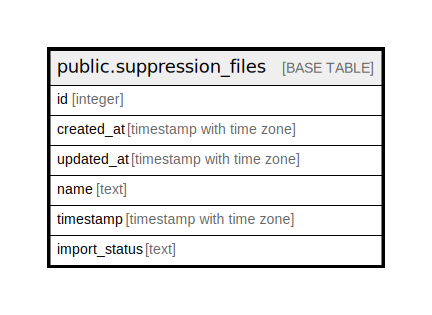

# public.suppression_files

## Description

## Columns

| Name | Type | Default | Nullable | Children | Parents | Comment |
| ---- | ---- | ------- | -------- | -------- | ------- | ------- |
| id | integer | nextval('suppression_files_id_seq'::regclass) | false |  |  |  |
| created_at | timestamp with time zone | now() | true |  |  |  |
| updated_at | timestamp with time zone | now() | true |  |  |  |
| name | text |  | false |  |  |  |
| timestamp | timestamp with time zone |  | false |  |  |  |
| import_status | text |  | true |  |  |  |

## Constraints

| Name | Type | Definition |
| ---- | ---- | ---------- |
| suppression_files_name_key | UNIQUE | UNIQUE (name) |
| suppression_files_pkey | PRIMARY KEY | PRIMARY KEY (id) |

## Indexes

| Name | Definition |
| ---- | ---------- |
| suppression_files_name_key | CREATE UNIQUE INDEX suppression_files_name_key ON public.suppression_files USING btree (name) |
| suppression_files_pkey | CREATE UNIQUE INDEX suppression_files_pkey ON public.suppression_files USING btree (id) |

## Triggers

| Name | Definition |
| ---- | ---------- |
| set_timestamp | CREATE TRIGGER set_timestamp BEFORE UPDATE ON public.suppression_files FOR EACH ROW EXECUTE FUNCTION trigger_set_timestamp() |

## Relations

---

> Generated by [tbls](https://github.com/k1LoW/tbls)
