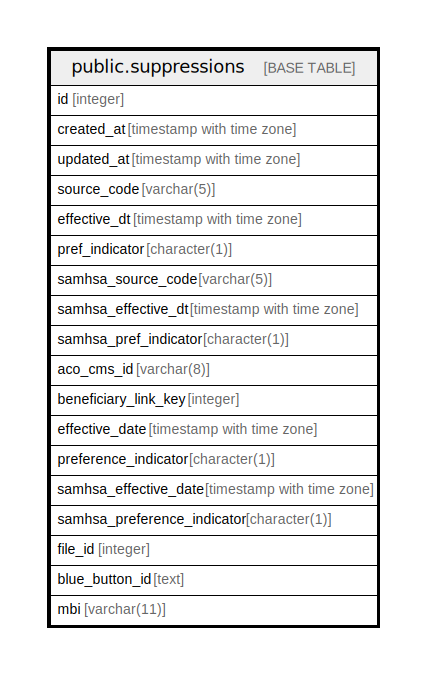

# public.suppressions

## Description

## Columns

| Name | Type | Default | Nullable | Children | Parents | Comment |
| ---- | ---- | ------- | -------- | -------- | ------- | ------- |
| id | integer | nextval('suppressions_id_seq'::regclass) | false |  |  |  |
| created_at | timestamp with time zone | now() | true |  |  |  |
| updated_at | timestamp with time zone | now() | true |  |  |  |
| source_code | varchar(5) |  | true |  |  |  |
| effective_dt | timestamp with time zone |  | true |  |  |  |
| pref_indicator | character(1) |  | true |  |  |  |
| samhsa_source_code | varchar(5) |  | true |  |  |  |
| samhsa_effective_dt | timestamp with time zone |  | true |  |  |  |
| samhsa_pref_indicator | character(1) |  | true |  |  |  |
| aco_cms_id | varchar(8) |  | true |  |  |  |
| beneficiary_link_key | integer |  | true |  |  |  |
| effective_date | timestamp with time zone |  | true |  |  |  |
| preference_indicator | character(1) |  | true |  |  |  |
| samhsa_effective_date | timestamp with time zone |  | true |  |  |  |
| samhsa_preference_indicator | character(1) |  | true |  |  |  |
| file_id | integer |  | false |  |  |  |
| blue_button_id | text |  | true |  |  |  |
| mbi | varchar(11) |  | true |  |  |  |

## Constraints

| Name | Type | Definition |
| ---- | ---- | ---------- |
| suppressions_pkey | PRIMARY KEY | PRIMARY KEY (id) |

## Indexes

| Name | Definition |
| ---- | ---------- |
| suppressions_pkey | CREATE UNIQUE INDEX suppressions_pkey ON public.suppressions USING btree (id) |
| idx_suppression_bb_id | CREATE INDEX idx_suppression_bb_id ON public.suppressions USING btree (blue_button_id) |
| idx_suppression_mbi | CREATE INDEX idx_suppression_mbi ON public.suppressions USING btree (mbi) |

## Triggers

| Name | Definition |
| ---- | ---------- |
| set_timestamp | CREATE TRIGGER set_timestamp BEFORE UPDATE ON public.suppressions FOR EACH ROW EXECUTE FUNCTION trigger_set_timestamp() |

## Relations

---

> Generated by [tbls](https://github.com/k1LoW/tbls)
