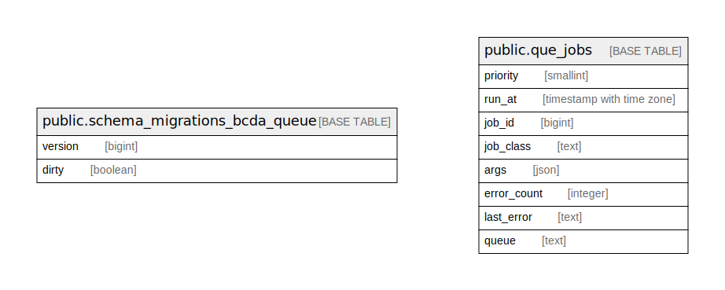

# bcda_queue

## Tables

| Name | Columns | Comment | Type |
| ---- | ------- | ------- | ---- |
| [public.schema_migrations_bcda_queue](public.schema_migrations_bcda_queue.md) | 2 |  | BASE TABLE |
| [public.que_jobs](public.que_jobs.md) | 8 | 3 | BASE TABLE |

## Relations

---

> Generated by [tbls](https://github.com/k1LoW/tbls)
