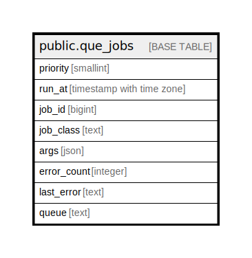

# public.que_jobs

## Description

3

## Columns

| Name | Type | Default | Nullable | Children | Parents | Comment |
| ---- | ---- | ------- | -------- | -------- | ------- | ------- |
| priority | smallint | 100 | false |  |  |  |
| run_at | timestamp with time zone | now() | false |  |  |  |
| job_id | bigint | nextval('que_jobs_job_id_seq'::regclass) | false |  |  |  |
| job_class | text |  | false |  |  |  |
| args | json | '[]'::json | false |  |  |  |
| error_count | integer | 0 | false |  |  |  |
| last_error | text |  | true |  |  |  |
| queue | text | ''::text | false |  |  |  |

## Constraints

| Name | Type | Definition |
| ---- | ---- | ---------- |
| que_jobs_pkey | PRIMARY KEY | PRIMARY KEY (queue, priority, run_at, job_id) |

## Indexes

| Name | Definition |
| ---- | ---------- |
| que_jobs_pkey | CREATE UNIQUE INDEX que_jobs_pkey ON public.que_jobs USING btree (queue, priority, run_at, job_id) |

## Relations

---

> Generated by [tbls](https://github.com/k1LoW/tbls)
