# BCDA File Decryption: An Example

### Contents
1. [Gathering the tools](#gathering-the-tools)
1. [Exploring the API with Swagger](#exploring-the-api-with-swagger)
1. [Requesting a file](#requesting-a-file)
1. [Decrypting a file](#decrypting-a-file)
1. [Reading further](#reading-further)
1. [Troubleshooting](#troubleshooting)

### Gathering the tools
To complete this decryption example, you will need:

- The `token` given to you by the BCDA team, ready to paste into your browser
- A file containing the example RSA `private key` ([download](https://github.com/CMSgov/bcda-app/blob/master/shared_files/ATO_private.pem))
- You can write your own decryption code later based on the [documentation](../API.md).  Today we'll use the [python example decryption code](https://gist.github.com/rnagle/a2b8ecb7905337afaf00c060024d4fb4), which requires:
    - [Python](https://www.python.org/downloads/) installed
    - [decrypt.py](https://gist.githubusercontent.com/rnagle/a2b8ecb7905337afaf00c060024d4fb4/raw/76191f339230f8c5085b711acd7482e74202168a/decrypt.py) and [requirements.txt](https://gist.githubusercontent.com/rnagle/a2b8ecb7905337afaf00c060024d4fb4/raw/76191f339230f8c5085b711acd7482e74202168a/requirements.txt) downloaded to the same directory

### Exploring the API with Swagger
We'll be interacting with the [BCDA API](../API.md) in your browser using [Swagger](https://swagger.io).  We'll be able to authenticate, make requests, and everything else the API provides.  

- Open your browser and navigate to:

#### [https://sandbox.bcda.cms.gov/api/v1/swagger](https://sandbox.bcda.cms.gov/api/v1/swagger/)

Let's provide our token to get full access to the API.

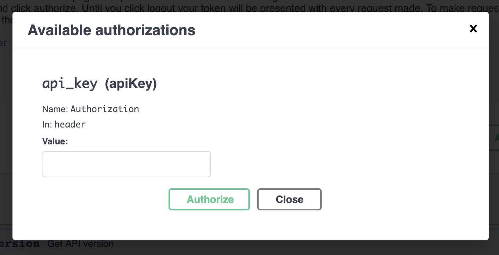

- Click the `Authorize` button
- Paste your `token` in the `api_key` box
- Click `Authorize`, then `Close`

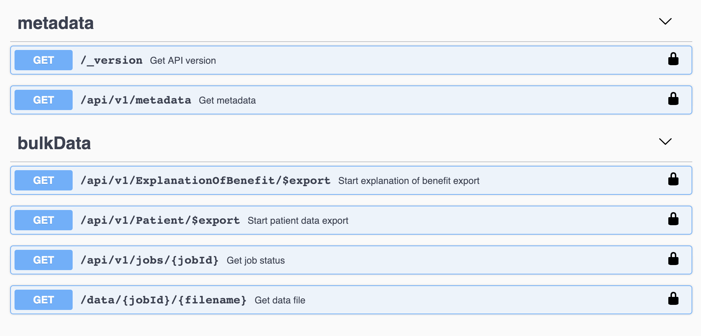

We have two types of encrypted files we could download: Patient and Explanation of Benefit (EoB).  Let's choose EoB today.

- Click the `/api/v1/ExplanationOfBenefit/$export` link

Notice that there's quite a bit of documentation here, from the parameter types to possible kinds of server responses.

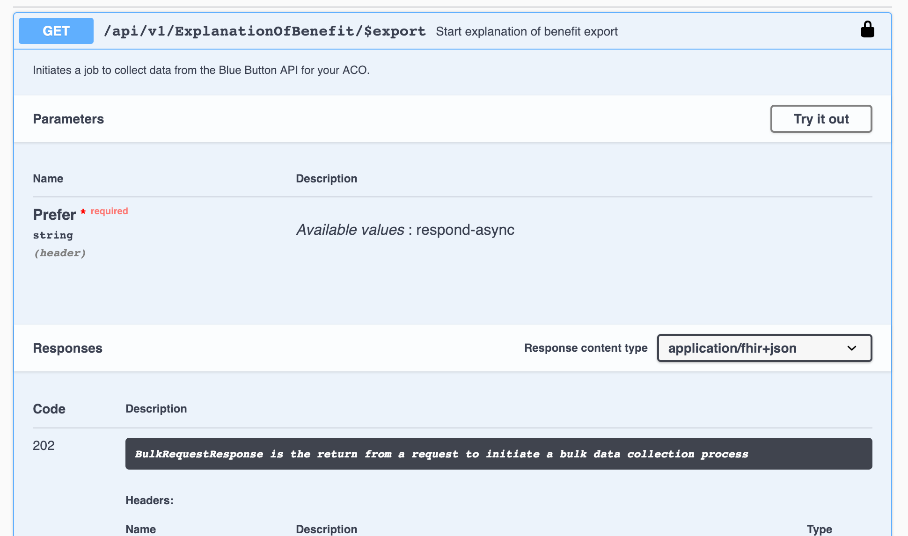

- Click `Try it out`, then `Execute`

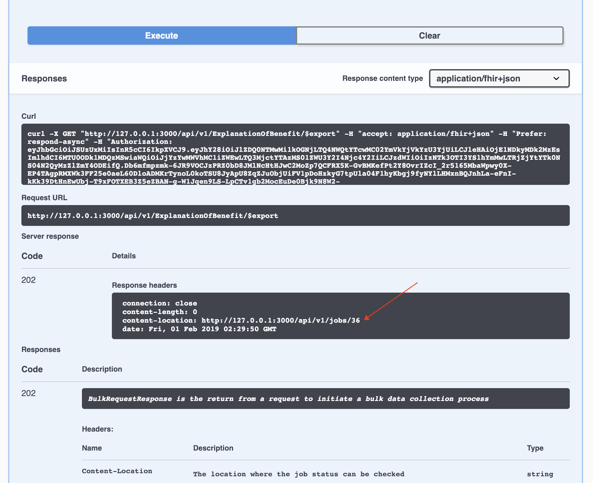

If you'd like to repeat this from the command line or implement this API call in code, look in the `Curl` section for the request we just made.  Not far below that under `Server response` you can see the response: an `HTTP` 202 success giving a link in the `content-location` header for status information on our EoB job.  

- Note the job ID number at the end of this link.
- Open the job status section in Swagger (click `/api/v1/jobs/{jobID}`)

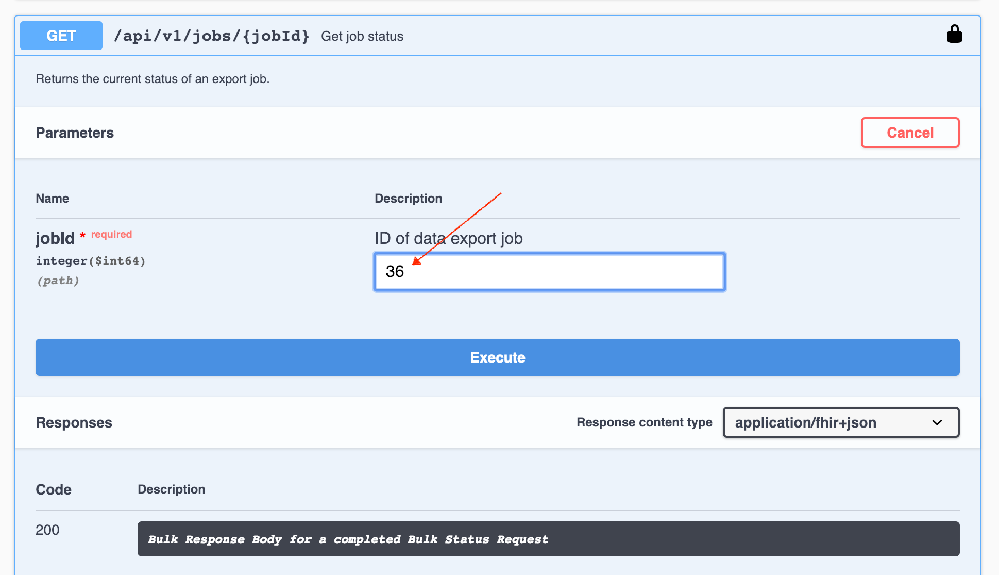

- Type the job ID we received
- Click `Execute`

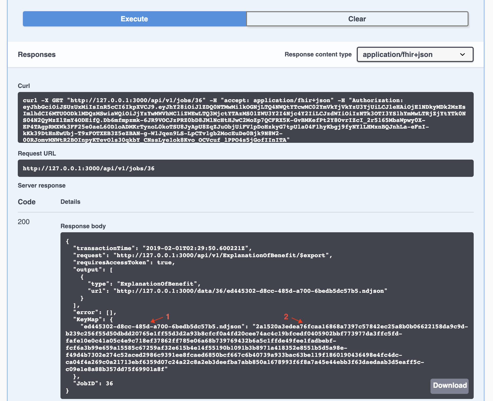

Depending on the size of the file, the job may take some time.  If the job is not yet complete, this will give us status information.  Shown below are the results for our completed job.  We can download the file from the URL provided.

Take special note of the new `KeyMap` section of the response.  To decrypt the file, we will need the filename (the first part of the keymap) and the [symmetric key](../ENCRYPTION.md#how-we-encrypt) (the second part of the keymap), as shown above.  There are no spaces in either one.

- Copy these values (filename and symmetric key) for later.

Our last API task is to download the encrypted file. 

- Open the data file section in Swagger (click `/api/v1/jobs/{jobID}/{filename}`)
- Paste the job ID and filename into the appropriate boxes
- Click `Execute`

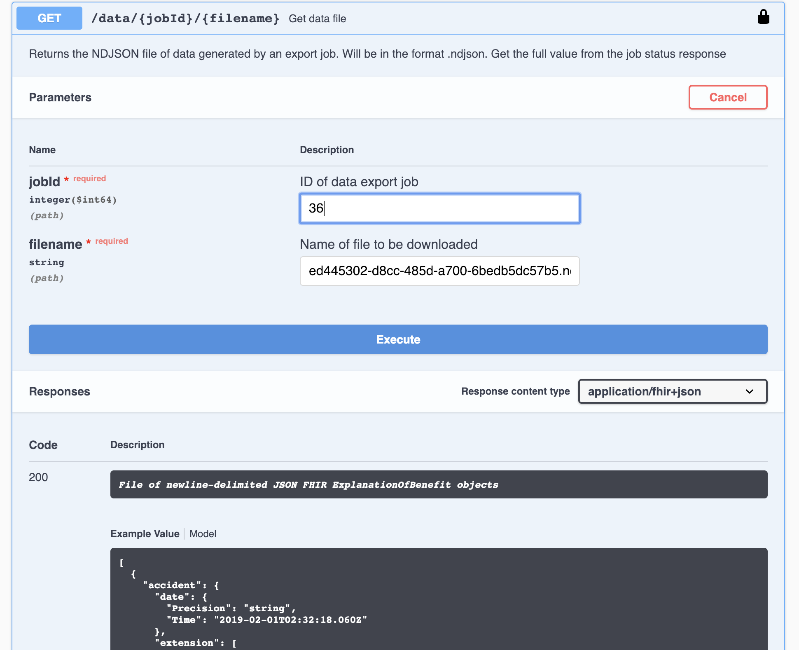

- Click the `Download file` link that appeared in the response section.  Note that a large sample file may take a while to download.

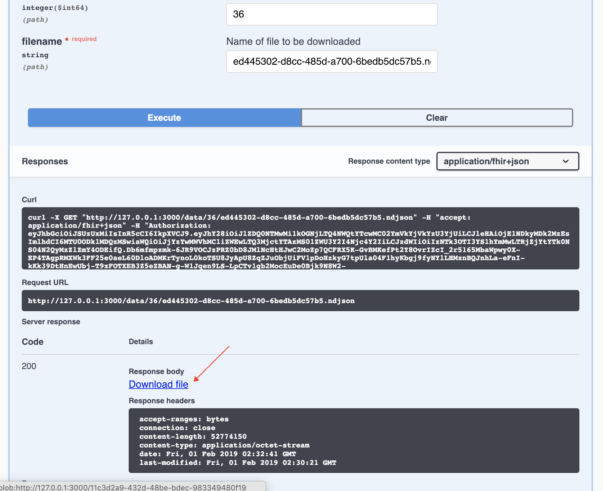

After downloading the file, we'll move to the command line.  Navigate to the directory you saved `decrypt.py` and `requirements.txt` in [earlier](#gathering-the-tools).

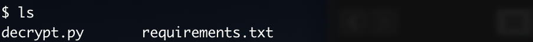

Let's verify that Python is running properly.  
- Run `decrypt.py` with the help argument (`python decrypt.py -h`).  You should get the response shown below.

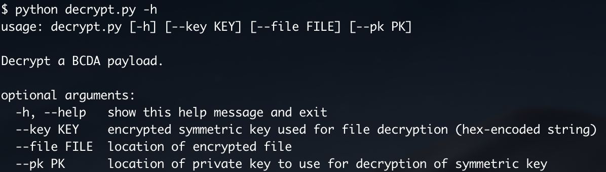

- Rename the downloaded file with the filename you saved earlier.

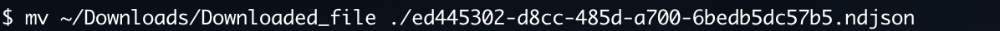

We're now ready to decrypt the file!  Our sample decryption tool will print the decrypted contents to the console, so we'll send the output to a file.  Make sure to use the following syntax, with the entire command on the same line:

    python decrypt.py 
        --pk   [location_of_private_key] 
        --file [location_of_encrypted_file] 
        --key  [symmetric_key_value]

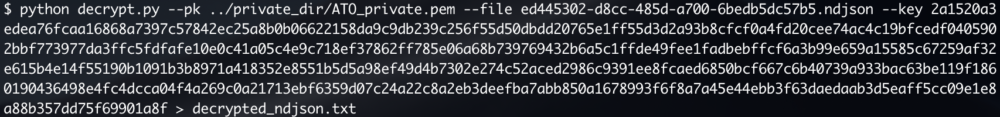

Take a look at the result.  If you do not see unencrypted [NDJSON](http://ndjson.org/) (two example lines shown below), then skip ahead to the [troubleshooting](#troubleshooting) section.

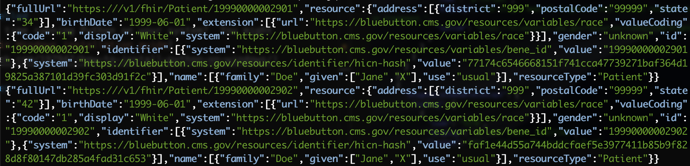

### Reading further
* [Encryption documentation](../ENCRYPTION.md)
* [API documentation](../API.md)

### Troubleshooting
#### Authentication problems in Swagger
- Has your token expired?  [Ask the support team](https://groups.google.com/forum/#!forum/bc-api) for a new token.
- Is the lock on the `Authorize` icon not closed?  Click it again, and after pasting your token in the `api_key` box, make sure to click the `Authorize` button.
- Are there any spaces or newlines in your token?  Remove them and paste it as a single line.

#### Python not installed
- Is this your first time running Python on your system?  You might be interested in [this Windows installation guide](https://www.howtogeek.com/197947/how-to-install-python-on-windows/)

#### Encryption issues
- The best practice would be to keep your private key in a separate, secured directory.  While you're testing the encryption feature for the first time, however, you may find it useful to have all the files in the same directory.
- Have you saved the encrypted file with exactly the filename provided by the API?  If not, rename it and try again.
- Is the symmetric key value provided with no spaces or newlines?  Double-check that no characters are missing from the beginning or end of the key.  